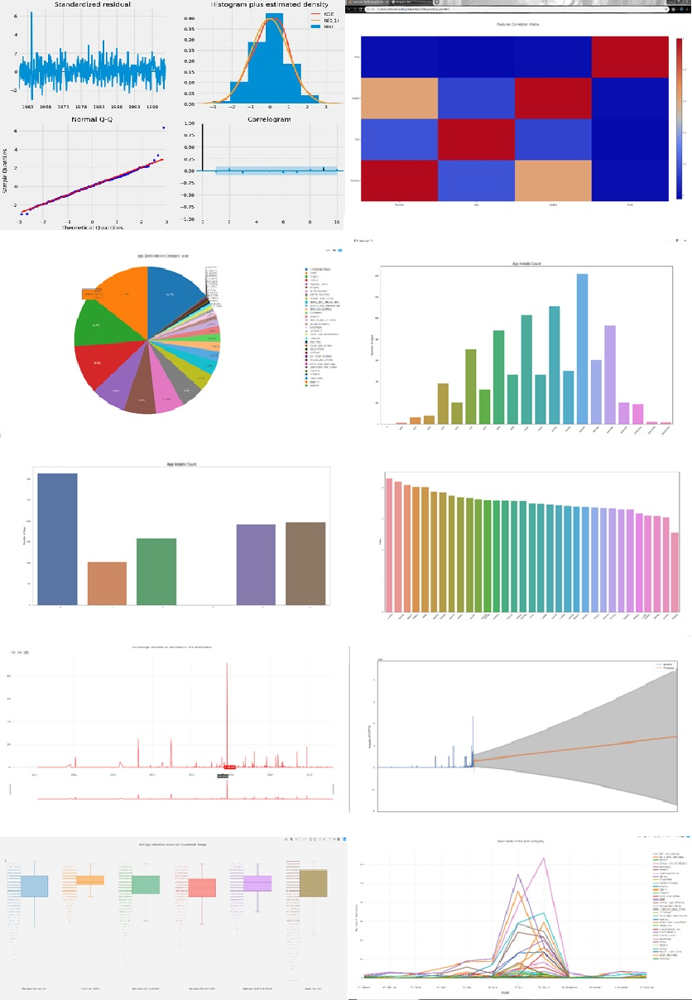

# Playstore Analysis
Dashboard made using Python Tkinter for analysis, visualization and trend forecasting of Playstore data.

# Table of Contents

* [Problem](https://github.com/amurto/playstore-analysis#problem)
* [Installation](https://github.com/amurto/playstore-analysis#installation)
  * [Prerequisites](https://github.com/amurto/playstore-analysis#prerequisites)
  * [Instructions](https://github.com/amurto/playstore-analysis#instructions)
* [Usage](https://github.com/amurto/playstore-analysis#usage)
* [Contributors](https://github.com/amurto/playstore-analysis#contributors)
* [License](https://github.com/amurto/playstore-analysis#license)

# Problem

Given a dataset of a leading software development and distribution firm, that helps individuals/firms in designing and launching comercially viable mobile apps. They conducted a survey of the user download behaviour on the apps across all categories on the Google Playstore. They also have pursued the user review for the contents that the users have downloaded and used over a period of time. The Company aims to take crucial decisions before their future launches on playstore. 

# Description

The solution created is a GUI dashboard created using Python Tkinter. Various charts are plotted after analysis of the Datasets using libraries like [Plotly](https://plotly.com/) and [Matplotlib](https://matplotlib.org/). Arima(AutoRegressive Integrated Moving Averages ) and Sarimax(Seasonal AutoRegressive Integrated Moving Averages with eXogenous regressors) are used to predict and forecast the Playstore download trend in the upcoming years. [Textblob](https://textblob.readthedocs.io/en/dev/) is used to calculate the sentiment polarity and subjectivity of user reviews. 
 
### Demo


# Installation

### Prerequisites

Install Python 3.6+ on the system

### Instructions

Clone the repository
```bash
git clone https://github.com/amurto/playstore-analysis.git
```

Install all the dependencies. Set up an environment if possible.
```bash
pip install -r requirements.txt
```

# Usage

Run the project. The Tkinter window will popup after running the script.
```bash
python app.py
```

# Contributors

* [@amurto](https://github.com/amurto)
* [@mahesh131998](https://github.com/mahesh131998)
* [@mishrashubham17](https://github.com/mishrashubham17)

# License

[](https://opensource.org/licenses/MIT)

[MIT License Link](https://github.com/amurto/playstore-analysis/blob/master/LICENSE)